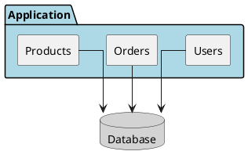
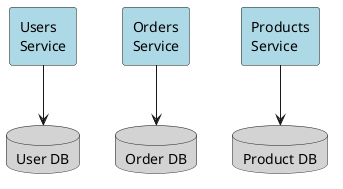
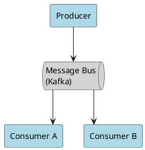
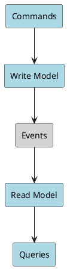

# Architecture Patterns

## Pattern Comparison

| Pattern              | Best For                    | Team Size | Trade-offs                                |
|----------------------|-----------------------------|-----------|-------------------------------------------|
| **Monolith**         | Simple domain, small team   | 1-10      | Simple deploy; hard to scale parts        |
| **Modular Monolith** | Growing complexity          | 5-20      | Module boundaries; still single deploy    |
| **Microservices**    | Complex domain, large org   | 20+       | Independent scale; operational complexity |
| **Serverless**       | Variable load, event-driven | Any       | Auto-scale; cold starts, vendor lock      |
| **Event-Driven**     | Async processing            | 10+       | Loose coupling; debugging complexity      |

## Monolith

**When to Use**:

- Starting a new project
- Small team (< 10 developers)
- Simple domain
- Rapid iteration needed

**Pros**: Simple deployment, easy debugging, no network latency
**Cons**: Hard to scale independently, technology locked, deployment risk

## Microservices

**When to Use**:

- Large team (20+ developers)
- Complex domain with clear boundaries
- Different scaling requirements per service
- Polyglot technology needs

**Pros**: Independent scaling, team autonomy, fault isolation
**Cons**: Distributed system complexity, eventual consistency, operational overhead

## Event-Driven

**When to Use**:

- Async processing required
- Loose coupling between services
- Event sourcing needs
- High throughput messaging

**Pros**: Decoupled services, scalable, audit trail
**Cons**: Eventual consistency, debugging complexity, message ordering

## CQRS (Command Query Responsibility Segregation)

**When to Use**:

- Read/write ratio heavily skewed
- Complex read queries
- Event sourcing architecture
- Different optimization needs

## Quick Reference

| Requirement      | Recommended Pattern |
|------------------|---------------------|
| Simple CRUD app  | Monolith            |
| Growing startup  | Modular Monolith    |
| Enterprise scale | Microservices       |
| Variable load    | Serverless          |
| Async processing | Event-Driven        |
| Read-heavy       | CQRS                |
